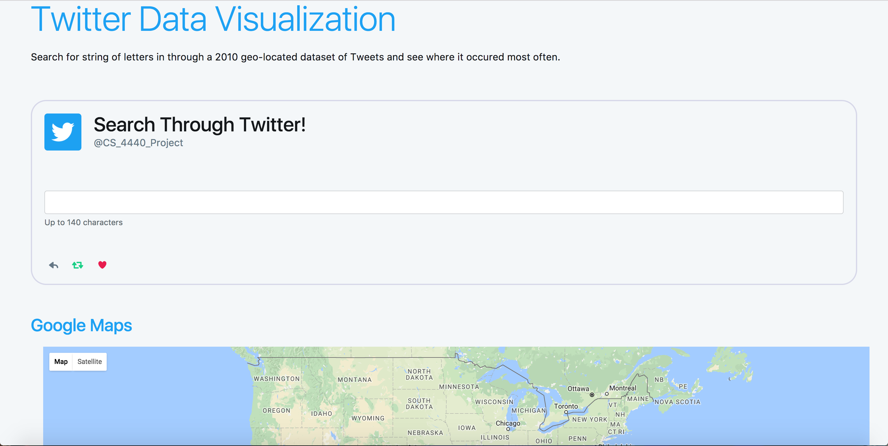

# Dataset-Visualization-CS-4440
### Data Visualization Project for CS 4440

App that searches through Twitter Datasets using Tweepy and filters based on location that user provides. It then filters based on most frequently occuring words. Built on Python, Flask, MongoDB, HTML, CSS, and Javascript.
